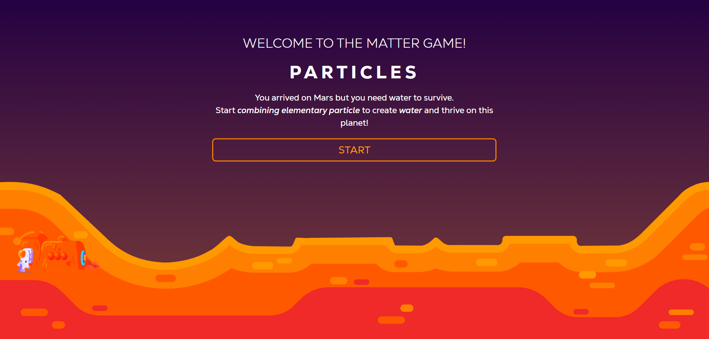
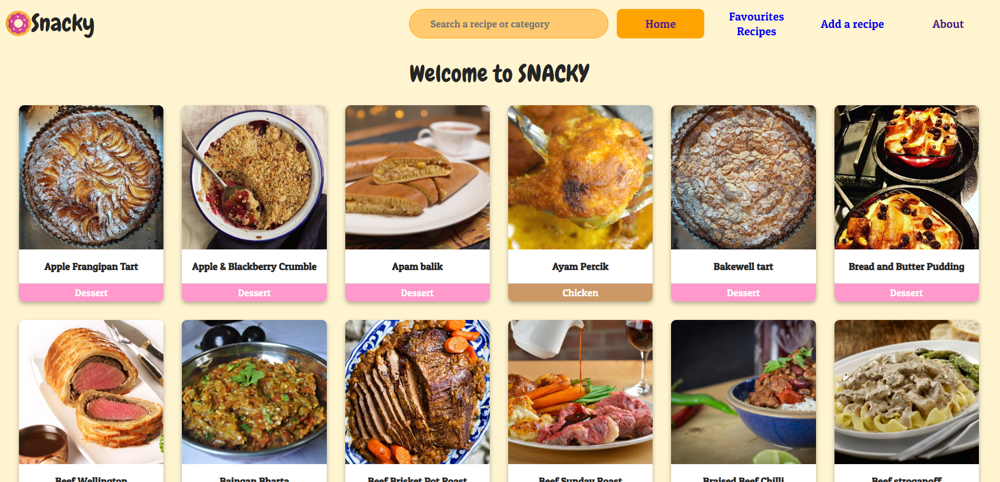
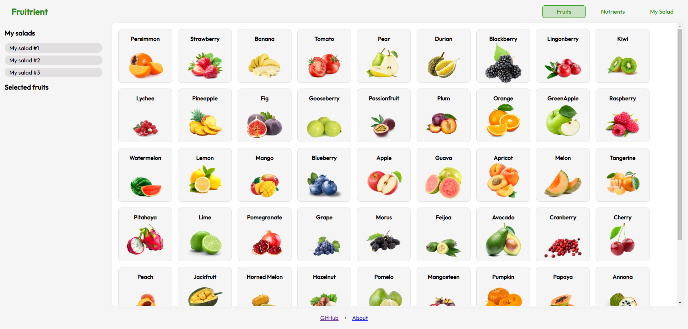
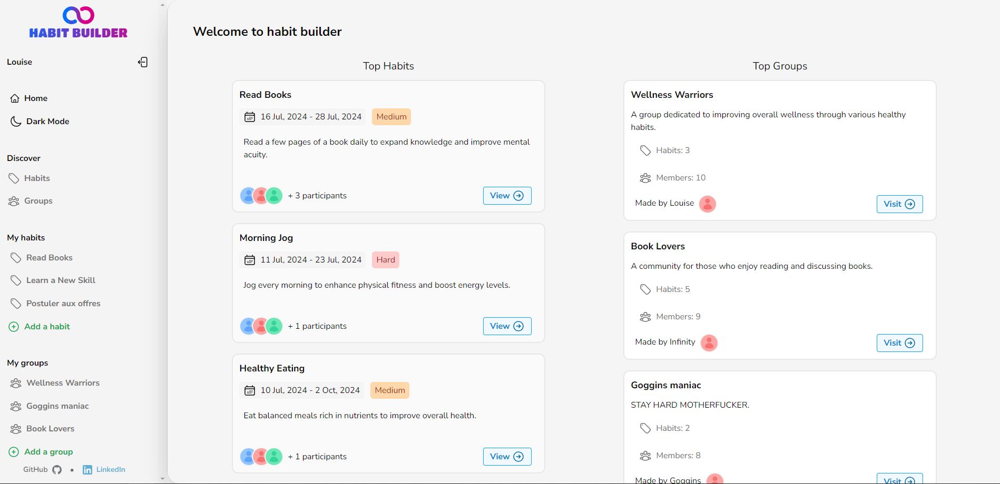

# IRON HACK BOOTCAMP

_Iron Hack is a school with a **project-oriented** learning method._  
_This bootcamp language was only **english** and lasted 9 weeks._

## PROJECTS

|       NAME        |      Goal       |                              Overview                               |                                                GITHUB                                                 |                                                     SLIDES                                                     | LIVE                                                      |
| :---------------: | :-------------: | :-----------------------------------------------------------------: | :---------------------------------------------------------------------------------------------------: | :------------------------------------------------------------------------------------------------------------: | --------------------------------------------------------- |
|  **MATTER GAME**  |  Create atoms   |     |                      [GitHub](https://github.com/LoicTramis/matter-game-project)                      | [Slides](https://docs.google.com/presentation/d/1V5USoVJSnDvbDtdO8cXx8qSUgImTIw9NFpLS1JHfUTo/edit#slide=id.p)  | [Live](https://loictramis.github.io/matter-game-project/) |
|    **SNACKY**     | Manage recipes  |      |                                     _Collaborative local project_                                     |
|  **FRUITRIENT**   | Nutrional value |  |  [GitHub](https://github.com/LoicTramis/IronHackBootcamp/tree/main/Projects/6-5-fruit-salad-project)  | [Slides](https://docs.google.com/presentation/d/1QPZkkM2lvvq2v0aqARFiW-hbYG7C3kS1cvoyi1JfeGw/edit?usp=sharing) | [Live](https://fruit-salad.netlify.app/)                  |
| **HABIT BUILDER** |  Forge habits   |       | [GitHub](https://github.com/LoicTramis/IronHackBootcamp/tree/main/Projects/9-5-habit-builder-project) | [Slides](https://docs.google.com/presentation/d/1_KSQ8Pt5jwqWQ4i_LXswy0WlLNc7-mRjahKqhMxPQDM/edit?usp=sharing) | [Live](https://habit-builder.netlify.app/)                |

## LABS

| Week |       Tech learned | Type of Exam                 |
| :--: | -----------------: | :--------------------------- |
|  1   |      JS Fondations | Assessment                   |
|  2   |    JS OOP / JS DOM | Assessment                   |
|  3   |        JS Closures | **_`Project`_**              |
|  4   |    React DOM / JSX | Collaborative                |
|  5   |        JS Promises | Assessment                   |
|  6   |        React Hooks | **_`Project`_**              |
|  7   |   NodeJS / MongoDB | Collaborative                |
|  8   |   Token Based Auth | Assessment                   |
|  9   |   _Time managment_ | **_`Project`_**              |
|  10  | _Stress managment_ | _Jury + Public presentation_ |
